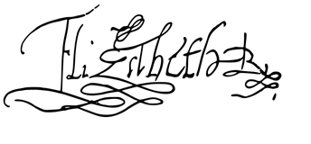

##  OBSERVACIONES

### 1) Si no se agregan los archivos ** .replit y run.sh ** no funciona
### 2) Eliminé el Main original desde el shell con ** rm Main.java **
### 3) Este proyecto quedará como plantilla para comenzar proyectos
### 4) Para agregar una imagen al readme.md se sube a replit (desde Upload file) y luego se agrega lo siguiente:
  
#### Todo el nombre de la imagen  tiene que estar en minúscula sino no se carga

