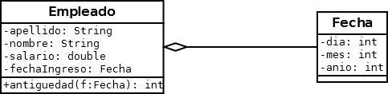
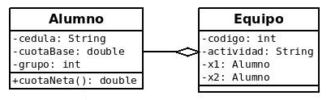
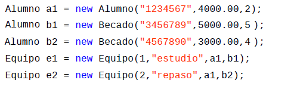

# PRACTICO 3 2022

https://replit.com/@utu_liceo/Articulo#README.md
## Clase ARTICULO
### Ejercicio 1 (Diagrama de clases): 
 Diseñar el diagrama de clases para las clases **Articulo** y **Fecha** (clases ya realizadas en prácticos anteriores). Agregue un nuevo atributo a la clase Articulo: vencimiento, de tipo Fecha. 
 Además en el diagrama deberá colocar un nuevo método, de nombre **estaVencido**, que recibe como parámetro un atributo de tipo Fecha y devuelve un valor de tipo boolean.
 >** Nota:** Para realizar el diagrama puede usar el programa Dia (como se muestra en la grabación de la clase del día 3 de junio). Una vez realizado lo puedo subir aquí mismo, desde los tres puntos - upload file

### Ejercicio 2 (Modificación de Articulo): 
Copie en un nuevo proyecto las **clases Articulo y Fecha** (clases ya realizadas en prácticos anteriores) . Modifique la clase de forma similar a lo realizado en el teórico con la clase Alumno.

### Ejercicio 3 (Método estaVencido): 
El método estaVencido compara el año de la Fecha recibida por parámetro con el año de la fecha de vencimiento. Si hay más 1 de diferencia, entonces devuelve true, caso contrario devuelve false.
### Ejercicio 4 (La clase Principal):
 Compruebe el correcto funcionamiento del programa con diversos objetos de la clase Fecha y Articulo.

 
 ##  CLASE EMPLEADO
https://replit.com/@utu_liceo/EmpleadoFecha#Z_README.md
### Descargue la carpeta **Empleado2**, descomprimala y dejela en su carpeta Workspace de eclipse (recuerde que tiene que importar desde eclipse la carpeta que le queda adentro con el mismo nombre)

### Copie la clase Empleado realizada en el práctico anterior al paquete logica y agreguele el atributo **fechaIingreso** de tipo Fecha
 
### Realizar los cambios necesarios para que funcione correctamente.
### **(Método antiguedad)**: El método antiguedad devuelve la cantidad de años de antiguedad (año de la fecha actual - año de la fecha de Ingreso). Tener en cuenta que la fecha actual la recibe por parámetro. 
### En la ** clase Principal** deberá crear un objeto de tipo Empleado y verificar el correcto funcionamiento del método específico.

### Una vez resuelto el ejercicio, borre la carpeta Empleado2 (la que está aquí) y suba su proyecto (el que tiene en Workspace de eclipse)

Nota: Se asume que la fecha de ingreso siempre será menor que la fecha actual

##  EQUIPOS DE ALUMNOS
https://replit.com/@utu_liceo/Equipo-de-alumnos#Z_README.md
### Descargue la carpeta **Equipos**, descomprimala y dejela en su carpeta Workspace de eclipse (recuerde que tiene que importar desde eclipse la carpeta que le queda adentro con el mismo nombre)

### 1)a)  Realice la clase **Alumno** en el paquete logica con los atributos que aprecia en su diagrama de clases. 
 
### b) **(Método cuotaNeta())**: El método cuotaNetase calcula de la siguiente manera: si el grupo es 1 y la cuotaBase menor de 1000, abonarán un 80% de la cuotaBase, si el grupo es 2 o 3, abonarán un 70% y el resto un 100%. 
*Recuerde que en el teórico de la unidad 2 tiene un ejemplo muy parecido*

### 2) Realice la clase **Equipo** en el paquete logica con los atributos que aprecia en su diagrama de clases. 

### **Importante:** Tanto la clase Alumno como la clase Equipo tienen sus métodos básicos (constructores, getter, setter, toString), recuerde que la mayoría de ellos puede generarlo

### 3) En la ** clase Principal** crear  3 objetos de tipo Alumno. Además crear dos equipos con los alumnos creados anteriormente. 
>Por ejemplo: 

> 

### **Se pide:**
### • Desplegar por pantalla las cédulas de los integrantes del equipo 1, utilizando los métodos correspondientes (nota: No puede utilizar los objetos a1 y b1, debe utilizar e1).
### • Desplegar por pantalla las cuotas líquidas de los integrantes del equipo 2, utilizando los métodos correspondientes (nota: No puede utilizar los objetos a1 y b2, debe utilizar e2).
### • ¿Se puede invocar el método setCuotaBase sobre el objeto e1?. Justifique.

>**Una vez resuelto el ejercicio, borre la carpeta *Equipos* (la que está aquí) y suba su proyecto (el que tiene en Workspace de eclipse)**
