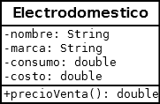
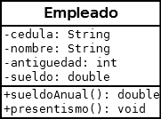

## PRACTICO 2 2022

Hacer un fork a los siguientes link y realizar lo que allí se pide:

https://replit.com/@utu_liceo/Ejer3-Electrodomestico#Z_README.md

https://replit.com/@utu_liceo/Ejer1-Auto#Z_README.md

https://replit.com/@utu_liceo/Ejer2-Empleado#Z_README.md

## PRACTICO 2B 2022

### 1) Utilizando la clase Electrodomestico del practico 2 

https://replit.com/@utu_liceo/Ejer3-Electrodomestico#Z_README.md

y teniendo en cuenta el Diagrama de Clase.

   

 Se pide agregar a la clase Electrodomestico el atributo costo y el método específico respetando el diagrama, es decir, NO pueden agregar cosas que no vea en el diagrama.

Los métodos hacen lo siguiente:

•       public double precioVenta(): El método devuelve el valor de costo con un incremento del 20% (o sea la operación a realizar es: costo*1.20).

•       public  String  toString(): Devuelve transformado en String: nombre marca, costo y precioVenta() del electrodomestico.     (ESTE HAY QUE MODIFICARLO!)

 

En la clase Principal deberá crear dos objetos de tipo electrodomestico, uno con todos los valores cargados con el constructor específico, otro con los métodos setters. Puede cargar los atributos con valores constantes, tal como se realizó en el teórico.

### 2) Utilizando la clase Empleado del practico 2 

 https://replit.com/@utu_liceo/Ejer2-Empleado#Z_README.md

y teniendo en cuenta el Diagrama de Clase.
   

Incluir todo lo solicitado en los ejercicios anteriores.

Los métodos hacen lo siguiente:

•       public double sueldoAnual(): El método devuelve el salario anual percibido

public void presentismo(): El método incrementa el valor de salario en un 10%.
•       public  String  toString(): Devuelve transformado en String: los atributos y salarioAnual() (ESTE HAY QUE MODIFICARLO!)

En la clase Principal deberá crear un objeto de tipo Empleado y verificar el correcto funcionamiento de los métodos específicos.

